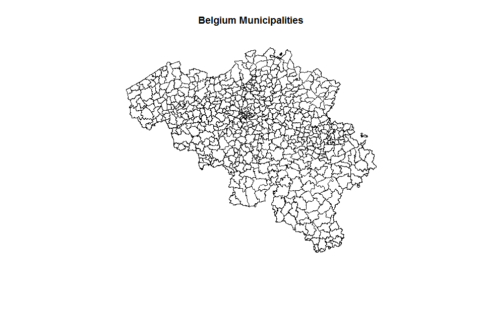
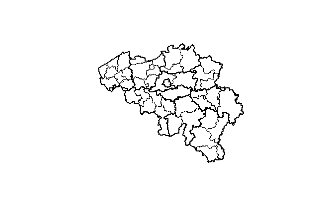

# Administrative boundaries of Belgium based on OpenStreetMap data

The BelgiumMaps.Admin R package allows R users to easily have data available containing **geographical administrative boundaries in Belgium**. It contains data available as part of OpenStreetMap (https://www.openstreetmap.org).

## License

**BelgiumMaps.Admin** is released under the Open Database License 1.0. http://opendatacommons.org/licenses/odbl/1-0/. You may use the data for any purpose, but you have to acknowledge OpenStreetMap as the data source.

## Installation

The package is available at datatailor.be
```
install.packages("BelgiumMaps.Admin", repos = "http://www.datatailor.be/rcube", type = "source")
```

To install the latest version from github:
```
devtools::install_github("jwijffels/BelgiumMaps.Admin", build_vignettes = TRUE)
## See the vignette
vignette("BelgiumMaps_AdministrativeAreas", package = "BelgiumMaps.Admin")
```

## Documentation of the BelgiumMaps.Admin package

This package contains data extracted from http://download.geofabrik.de/europe-latest.osm.pbf on 2015/11/19 with OpenStreetMap data up to 2015-11-18T22:23:02Z.

### Administrative boundaries

The europe-latest.osm.pbf was clipped with the bounding box 51.6, 49.4, 2.3, 6.5 using osmosis and the resulting file was imported with osm2pgsql in PostGIS and converted to a shapefile with pgsql2shp to obtain shape files of polygons of administrative boundaries of administrative levels 2, 4, 6, 7, 8, 9. More information about administrative levels in OpenStreetMap: http://wiki.openstreetmap.org/wiki/Tag:boundary%3Dadministrative.
The data was further joined based on the INS code and spatially grouped at different administrative levels municipality/district/province/region/country as well as clipped to the Belgium boundary.
These administrative boundaries are made available in the BE_OSM_ADMIN dataset which can be found inside the package.

```
library(BelgiumMaps.Admin)
library(sp)
data(BE_OSM_ADMIN) 
plot(BE_OSM_ADMIN)
plot(subset(BE_OSM_ADMIN, admin.level == 8), main = "Belgium Municipalities")
str(as.data.frame(BE_OSM_ADMIN))
```


### Administrative levels

The data at the levels of the municipality/district/province/region/country are also directly available in the package. These are enriched with NIS codes from the BelgiumStatistics package.
```
data(BE_OSM_ADMIN_MUNTY)
data(BE_OSM_ADMIN_DISTRICT) 
data(BE_OSM_ADMIN_PROVINCE) 
data(BE_OSM_ADMIN_REGION) 
data(BE_OSM_ADMIN_COUNTRY) 

plot(BE_OSM_ADMIN_DISTRICT)
plot(BE_OSM_ADMIN_PROVINCE, lwd = 2, add = TRUE)
## Look at the enrichment
str(BE_OSM_ADMIN_DISTRICT@data)
'data.frame':	43 obs. of  9 variables:
 $ CD_DSTR_REFNIS      : int  11000 12000 13000 21000 23000 24000 25000 31000 32000 33000 ...
 $ TX_ADM_DSTR_DESCR_NL: chr  "Arrondissement Antwerpen" "Arrondissement Mechelen" ...
 $ TX_ADM_DSTR_DESCR_FR: chr  "Arrondissement d’Anvers""| __truncated__ "Arrondissement de Malines" ...
 $ CD_PROV_REFNIS      : int  10000 10000 10000 4000 20001 20001 20002 30000 30000 30000 ...
 $ TX_PROV_DESCR_NL    : chr  "Provincie Antwerpen" "Provincie Antwerpen" "Provincie Antwerpen" ...
 $ TX_PROV_DESCR_FR    : chr  "Province dAnvers""| __truncated__ "Province dAnvers""|  ...
 $ CD_RGN_REFNIS       : int  2000 2000 2000 4000 2000 2000 3000 2000 2000 2000 ...
 $ TX_RGN_DESCR_NL     : chr  "Vlaams Gewest" "Vlaams Gewest" "Vlaams Gewest" ...
 $ TX_RGN_DESCR_FR     : chr  "Région flamande" "Région flamande" "Région flamande" ...
```



The BE_OSM_ADMIN spatial data contains NIS codes which where extracted from the ref:INS tag of the OpenStreetmap polygon. These can be used to link with the BelgiumStatistics NIS code identifier which is present in the data of the BelgiumStatistics package. This package can be found at https://github.com/jwijffels/BelgiumStatistics. Example shown below.

```
library(BelgiumStatistics)
library(BelgiumMaps.Admin)
library(data.table)
library(leaflet)

data(BE_OSM_ADMIN, package = "BelgiumMaps.Admin")
data(TF_SOC_POP_STRUCT_2015, package = "BelgiumStatistics")

x <- as.data.table(TF_SOC_POP_STRUCT_2015)
x <- x[, list(MS_POPULATION = sum(MS_POPULATION),
              Females = 100 * sum(MS_POPULATION[CD_SEX == "F"]) / sum(MS_POPULATION)),
       by = list(CD_MUNTY_REFNIS, TX_MUNTY_DESCR_NL, TX_MUNTY_DESCR_FR)]

mymap <- subset(BE_OSM_ADMIN, !is.na(tag.ref.ins))
myenrichedmap <- merge(mymap, x, by.x = "tag.ref.ins", by.y = "CD_MUNTY_REFNIS", all.x=TRUE, all.y=FALSE)
myenrichedmap <- subset(myenrichedmap, !is.na(Females))
pal <- colorNumeric(palette = "Blues", domain = myenrichedmap$Females)
leaflet(myenrichedmap) %>%
  addTiles() %>%
  addPolygons(stroke = FALSE, smoothFactor = 0.2, fillOpacity = 0.85, color = ~pal(Females)) %>%
  addPopups(lng = 4.366354, lat = 50.86619, popup="BNOSAC offices<br/>www.bnosac.be")
```


## More geospatial data from OpenStreetMaps

The BelgiumMaps.OpenStreetMap package contains more datasets which can be used alongside the administrative boundaries. Namely **landuse, natural, places, points, railways, roads and waterways**. 
This package can be found at https://github.com/jwijffels/BelgiumMaps.OpenStreetMap


## Do you need these boundaries in another format?

```
require(BelgiumMaps.Admin)
data(BE_OSM_ADMIN)

## As a shapefile
require(maptools)
writePolyShape(BE_OSM_ADMIN, fn = "BE_OSM_ADMIN")

## As a geojson
require(geojsonio)
geojson_write(BE_OSM_ADMIN, file = "BE_OSM_ADMIN.geojson", geometry = "polygon")
```

## Support in geospatial analysis

Need support in geospatial analysis or geospatial mapping. 
Contact BNOSAC: http://www.bnosac.be

